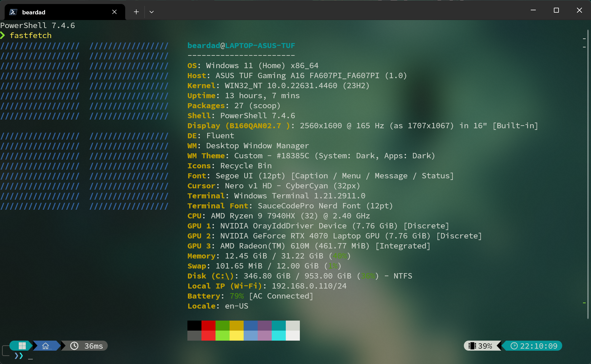
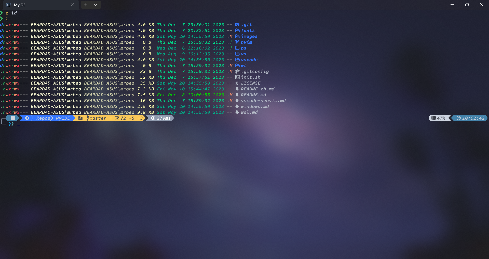

<div align="center">

# MyIDE

✨ 一份帮助你配置并构建整个开发 Windows 环境的指南，包括桌面、终端、Shell 和编辑器


</div>

---

- [MyIDE](#myide)
  - [桌面](#桌面)
    - [桌面安装](#桌面安装)
    - [桌面使用](#桌面使用)
  - [终端](#终端)
    - [终端安装](#终端安装)
    - [终端使用](#终端使用)
  - [PowerShell](#powershell)
    - [PowerShell 安装](#powershell-安装)
    - [PowerShell 使用](#powershell-使用)
  - [VSCode-Neovim](#vscode-neovim)

## 桌面

<div align="center">


</div>

### 桌面安装

- 打开设置界面安装中文语言包，并设置微软中文输入法，执行[xhup.reg](./ime/xhup.reg)安装小鹤双拼

- 安装 [TranslucentTB](https://apps.microsoft.com/detail/9PF4KZ2VN4W9?hl=en-US&gl=US)：一个轻量的任务栏透明化工具

- 安装 [PowerToys](https://apps.microsoft.com/detail/XP89DCGQ3K6VLD?hl=en-us&gl=US)：一个包含许多实用工具的集合

- 安装 [Sysinternals](https://apps.microsoft.com/detail/9p7knl5rwt25)：一个包含许多用于监控系统或进程的信息或行为的工具的集合，这是我的 [Process Explorer Column Set](./sysinternals/ProcessExplorerColumnSet.reg)

- 安装 [Snipaste](https://apps.microsoft.com/detail/9P1WXPKB68KX?hl=en-us&gl=US)：一个非常好用的截图工具

- 安装一款 [Nerd 字体](https://www.nerdfonts.com/font-downloads)：Nerd 字体包含了许多常用图标和符号，被许多命令行程序使用

- 安装一款你喜欢的 [鼠标主题](https://zhutix.com/tag/cursors/)

- `Win`+`I` 打开设置面板看看有什么需要设置的

### 桌面使用

| 快捷键            | 描述           |
| ----------------- | -------------- |
| `Win`+`E`         | 文件管理器     |
| `Win`+`{num}`     | 启动任务栏软件 |
| `Win`+`Up`        | 最大化窗口     |
| `Win`+`Down`      | 最小化窗口     |
| `Win`+`Left`      | 固定到左半屏   |
| `Win`+`Right`     | 固定到右半屏   |
| `Alt`+`Tab`       | 切换窗口       |
| `Alt`+`F4`        | 关闭窗口       |
| `Win`+`D`         | 显示桌面       |
| `Win`+`,`         | 预览桌面       |
| `Win`+`L`         | 锁屏           |
| `Win`+`;`         | Emoji          |
| `Win`+`Shift`+`?` | 快捷键帮助     |

## 终端

<div align="center">



</div>

### 终端安装

- 安装 [Windows Terminal](https://apps.microsoft.com/detail/9N0DX20HK701?hl=en-us&gl=US)

- 打开 Windows Terminal 然后按 `Ctrl`+`Shift`+`,` 打开配置文件，这是我的[**settings.json**](./wt/settings.json) 你可以参考

> 小贴士:
>
> - 所有颜色主题都被调整了以适配系统浅色主题
> - 配置中的字体设置为`SauceCodePro Nerd Font`

### 终端使用

| 快捷键                 | 描述                           |
| ---------------------- | ------------------------------ |
| `Win`+`` ` ``          | 下拉或收起终端                 |
| `Ctrl`+`Shift`+`{num}` | 用第`{num}`个 profile 新建 Tab |
| `Ctrl`+`Shift`+`D`     | 重复当前 Tab                   |
| `Ctrl`+`Shift`+`W`     | 关闭 Tab                       |
| `Alt`+`Shift`+`S`      | 水平切分                       |
| `Alt`+`Shift`+`V`      | 垂直切分                       |
| `Alt`+`Shift`+`Z`      | 缩放面板                       |
| `Alt`+`Left`           | 聚焦左边                       |
| `Alt`+`Right`          | 聚焦右边                       |
| `Alt`+`Up`             | 聚焦上边                       |
| `Alt`+`Down`           | 聚焦下边                       |
| `MouseSelect`          | 复制                           |
| `Shift`+`MouseSelect`  | 增量复制                       |
| `Alt`+`MouseSelect`    | 块区域复制                     |
| `Ctrl`+`Shift`+`V`     | 粘贴                           |
| `Ctrl`+`Shift`+`F`     | 搜索                           |

## PowerShell

<div align="center">



</div>

### PowerShell 安装

- 安装 [PowerShell](https://apps.microsoft.com/detail/9MZ1SNWT0N5D?hl=en-us&gl=US)

- 安装 [scoop-proxy-cn](https://github.com/lzwme/scoop-proxy-cn)：一款 Windows 下好用的包管理器的国内镜像

- 安装必要工具和 PowerShell 模块

  ```ps1
  # 必要安装
  scoop install 7zip git # aria2
  scoop install oh-my-posh zoxide lsd bat ripgrep fd fzf
  Install-Module posh-git
  Install-Module PSFzf

  # 可选安装（推荐）
  scoop install fastfetch cht tokei lazygit everything
  cp .\bat\config ~\AppData\Roaming\bat\config
  cp .\lazygit\config.yml ~\AppData\Local\lazygit\config.yml
  ~\scoop\apps\7zip\current\install-context.reg
  ~\scoop\apps\everything\current\install-context.reg
  # 将 %USERPROFILE%\scoop\apps\git\current\user\bin 加到环境变量 PATH 通常挺有用

  scoop install go
  go env -w GOPROXY=https://mirrors.aliyun.com/goproxy/,direct GOSUMDB=sum.golang.google.cn GOBIN=$HOME\go\bin

  scoop install rustup
  mkdir ~\.cargo
  echo @"
  [source.crates-io]
  replace-with = 'aliyun'
  [source.aliyun]
  registry = "sparse+https://mirrors.aliyun.com/crates.io-index/"
  "@ >> ~\.cargo\config

  scoop install nodejs
  npm config set registry https://registry.npmmirror.com

  scoop install python
  pip config set global.index-url http://mirrors.aliyun.com/pypi/simple/
  ```

- 在 PowerShell 中执行`notepad $PROFILE`来更改配置文件，这是我的 [**profile.ps1**](./ps/Microsoft.PowerShell_profile.ps1) 你可以参考

- 复制主题文件 [base16_bear.omp.json](./powershell/base16_bear.omp.json) 到 `%USERPROFILE%\Documents\PowerShell\base16_bear.omp.json`

- 配置 `%USERPROFILE%\.gitconfig`

  ```toml
  [user]
    name = Your Name
    email = username@email.com
  [core]
    editor = nvim
  [diff]
    tool = nvimdiff
  ```

- 配置 `%USERPROFILE%\.ssh\config`，如此你便可通过形如`git@github.com:user/repo`的 ssh url 来 push 或 pull github 仓库了。当然，你需要先将你自己的 ssh 公钥添加到 github

  ```txt
  Host github.com
     Hostname ssh.github.com
     Port 443
     User git
     IdentitiesOnly yes
     IdentityFile ~/.ssh/key.pem
  ```

> 有关 WSL 的配置在[这里](https://github.com/mrbeardad/MyIDE/tree/d0302ad521fb73f6d099e46bdc4a65ab0626d564?tab=readme-ov-file#wsl)，WSL/Linux 的 dotfiles 仍在仓库中，你可以自行查看参考

### PowerShell 使用

| 快捷键     | 描述                                    |
| ---------- | --------------------------------------- |
| `Esc`      | Vi 模式，按`v`可打开`$EDITOR`来编辑命令 |
| `Ctrl`+`A` | 行首                                    |
| `Ctrl`+`E` | 行尾                                    |
| `Ctrl`+`H` | 删除前一个字符                          |
| `Ctrl`+`W` | 删除前一个字词                          |
| `Ctrl`+`U` | 删除前面所有                            |
| `Ctrl`+`K` | 删除后面所有                            |
| `Ctrl`+`Z` | 撤销                                    |
| `Ctrl`+`Y` | 重做                                    |
| `Tab`      | 补全                                    |
| `Ctrl`+`P` | 上条匹配当前输入的历史命令              |
| `Ctrl`+`N` | 下条匹配当前输入的历史命令              |
| `Ctrl`+`R` | 模糊搜索历史命令                        |
| `Alt`+`A`  | 模糊搜索历史命令参数                    |
| `Ctrl`+`T` | 模糊搜索文件                            |
| `Alt`+`C`  | 模糊搜索目录并跳转                      |

| 实用命令      | 描述                                                        |
| ------------- | ----------------------------------------------------------- |
| `l`           | 列出文件 (requrie lsd)                                      |
| `tree`        | 树状格式列出文件 (require lsd)                              |
| `z`           | 模糊匹配并跳转目录 (require zoxide)                         |
| `zi`          | 交互地模糊匹配并调整目录 (require zoxide)                   |
| `zoxide edit` | 手动调整目录调整优先级                                      |
| `tokei`       | 项目代码统计                                                |
| `cht`         | 搜索帮助信息 [cheat.sh](https://github.com/chubin/cheat.sh) |
| `px`          | 设置代理                                                    |
| `notify`      | 系统通知弹窗, e.g. `notify "Title" "Body"`                  |

| Git Aliases | Git subcommand | Description                                                                                              |
| ----------- | -------------- | -------------------------------------------------------------------------------------------------------- |
| `gst`       | `status`       | Show all changes in workspace and index                                                                  |
| `ga`        | `add`          | Update changes from workspace to index                                                                   |
| `gaa`       | `add`          | Update all changes from workspace to index                                                               |
| `gau`       | `add`          | Update all changes from workspace to index exclude untracked files                                       |
| `gcln`      | `clean`        | Clean all untracked files                                                                                |
| `grs`       | `restore`      | Restore workspace from index **(default)** or a commit                                                   |
| `gstl`      | `stash`        | Show stashes                                                                                             |
| `gsta`      | `stash`        | Stash all changes in workspace and index                                                                 |
| `gstp`      | `stash`        | Restore the changes from stash and delete it **(default last)**                                          |
| `gstaa`     | `stash`        | Restore the changes from stash **(default last)**                                                        |
| `gstd`      | `stash`        | Delete stash **(default last)**                                                                          |
| `gc`        | `commit`       | Add a new commit from index                                                                              |
| `gc!`       | `commit`       | Add a new commit base on grandparent commit and move HEAD to it (like overwrite but keep history commit) |
| `glg`       | `log`          | Show commit and its ancestry, revision form like `HEAD^`                                                 |
| `grlg`      | `reflog`       | Show commits of HEAD history, revision form like `@{1}`                                                  |
| `gd`        | `diff`         | Show changes **(default between workspace and index)**                                                   |
| `gdt`       | `difftool`     | Show changes **(default between workspace and index)** by `nvim`                                         |
| `gmt`       | `mergetool`    | Resolve conflicts by `nvim`, or you can use `gco --ours` or `gco --theirs`                               |
| `gm`        | `merge`        | Merge a commit to HEAD, and do not allow fast forward                                                    |
| `gmc`       | `merge`        | Continue merge                                                                                           |
| `gms`       | `merge`        | Skip current patch and continue merge                                                                    |
| `gma`       | `merge`        | Abort merge                                                                                              |
| `grb`       | `rebase`       | Rebase HEAD **(default)** or commit onto a commit                                                        |
| `grbc`      | `rebase`       | Continue rebase                                                                                          |
| `grbs`      | `rebase`       | Skip current patch and continue rebase                                                                   |
| `grba`      | `rebase`       | Abort rebase                                                                                             |
| `gcp`       | `cherry-pick`  | Apply change in a commit to HEAD                                                                         |
| `gcpc`      | `cherry-pick`  | Continue cherry pick                                                                                     |
| `gcps`      | `cherry-pick`  | Skip current patch and continue cherry pick                                                              |
| `gcpa`      | `cherry-pick`  | Abort cherry pick                                                                                        |
| `grv`       | `revert`       | Revert a commit to HEAD                                                                                  |
| `grvc`      | `revert`       | Continue revert                                                                                          |
| `grvs`      | `revert`       | Skip current patch and continue revert                                                                   |
| `grva`      | `revert`       | Abort revert                                                                                             |
| `grh`       | `reset`        | Reset HEAD to a commit and keep all the changes in workspace and index                                   |
| `grhh`      | `reset`        | Reset HEAD to a commit and do not keep the changes                                                       |
| `gbl`       | `branch`       | Show branches                                                                                            |
| `gb`        | `branch`       | Add new branch at HEAD **(default)** or commit                                                           |
| `gcb`       | `checkout`     | Add new branch at HEAD **(default)** or commit and checkout it                                           |
| `gcb!`      | `checkout`     | Add new branch at HEAD **(default)** or commit (overwrite exist) and checkout it                         |
| `gbu`       | `branch`       | Set upstream of HEAD                                                                                     |
| `gbrn`      | `branch`       | Rename branch at HEAD **(default)** or commit                                                            |
| `gbrn!`     | `branch`       | Rename branch at HEAD **(default)** or commit (overwrite exist)                                          |
| `gbd`       | `branch`       | Delete merged branch                                                                                     |
| `gbd!`      | `branch`       | Delete branch even if not merged                                                                         |
| `gco`       | `checkout`     | Checkout target commit                                                                                   |
| `gcor`      | `checkout`     | Checkout target commit recursively                                                                       |
| `gr`        | `remote`       | Remote                                                                                                   |
| `grl`       | `remote`       | List remotes                                                                                             |
| `gra`       | `remote`       | Add remote                                                                                               |
| `grrn`      | `remote`       | Rename remote                                                                                            |
| `gru`       | `remote`       | Set thr url of remote                                                                                    |
| `grd`       | `remote`       | Delete remote                                                                                            |
| `gf`        | `fetch`        | Fetch remotes                                                                                            |
| `gl`        | `pull`         | Pull remotes and rebase, and automatically stash push and pop before and after                           |
| `gp`        | `push`         | Push a ref to remote                                                                                     |
| `gp!`       | `push`         | Push a ref to remote (`--force-with-lease`)                                                              |
| `gp!!`      | `push`         | Push a ref to remote (`--force`)                                                                         |
| `gcl`       | `clone`        | Clone remote                                                                                             |
| `gclr`      | `clone`        | Clone remote recursively                                                                                 |
| `gsa`       | `submodule`    | Add a submodule                                                                                          |
| `gsu`       | `submodule`    | Init and update submodules to expected version. To modify submodule,                                     |
| `gsd`       | `submodule`    | Delete a submodule                                                                                       |
| `lg`        |                | Open [Lazygit](https://github.com/jesseduffield/lazygit)                                                 |
| `gig`       |                | Create a .gitignore template for you, .e.g `gig c++,windows`                                             |

> 小贴士:
>
> - 你无需记住所有 git 别名，使用你喜欢的 git ui 工具即可，比如 lazygit、fork 或 gitkraken 等。列出这么多 git 别名的目的在于告诉你哪些 git 基础操作是你应该知道的
> - 推荐 [这篇博文](https://nvie.com/posts/a-successful-git-branching-model/) 描述了 git flow

## VSCode-Neovim

<div align="center">


</div>

1. 安装 Neovim 和 C/C++ 工具链

   ```ps1
   scoop install neovim mingw-mstorsjo-llvm-ucrt cmake
   ```

2. 配置 Neovim

   ```ps1
   # required
   Move-Item $env:LOCALAPPDATA\nvim $env:LOCALAPPDATA\nvim.bak
   # optional but recommended
   Move-Item $env:LOCALAPPDATA\nvim-data $env:LOCALAPPDATA\nvim-data.bak
   # clone
   git clone https://github.com/mrbeardad/nvim $env:LOCALAPPDATA\nvim
   # start and install plugins
   nvim
   ```

3. 安装 [VSCode](https://apps.microsoft.com/detail/XP9KHM4BK9FZ7Q?hl=en-US&gl=US)

4. 配置 VSCode

   1. 这是我的 [settings.json](vscode/settings.json) 和 [keybindings.json](vscode/keybindings.json)，你可以复制到 `%APPDATA%\Code\User`
   2. 这是我的 [lastSyncextensions.json](vscode/lastSyncextensions.json)，你可以复制到 `%APPDATA%\Code\User\sync\extensions\`

5. **更多关于 vscode 和 neovim 的配置与使用，见[mrbeardad/nvim](https://github.com/mrbeardad/nvim)**
