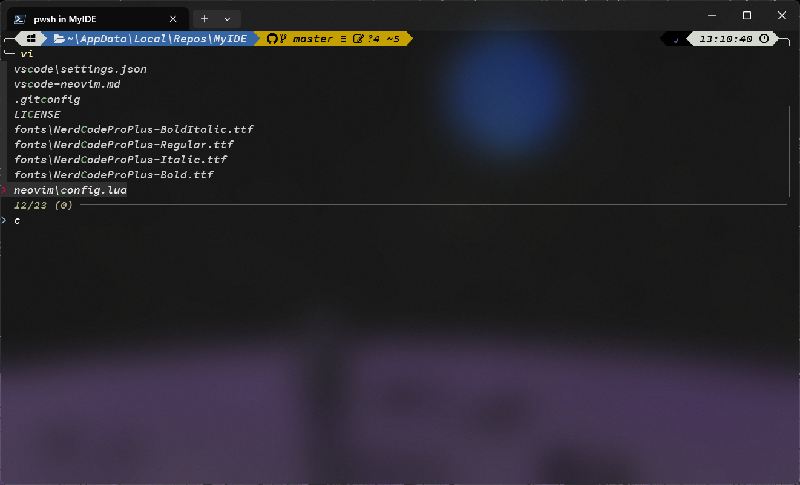
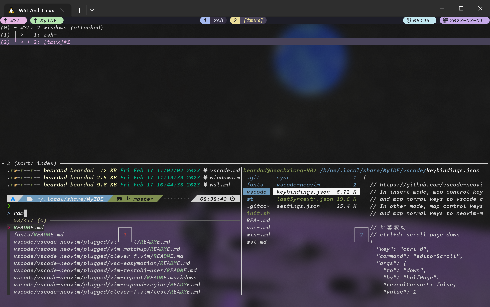
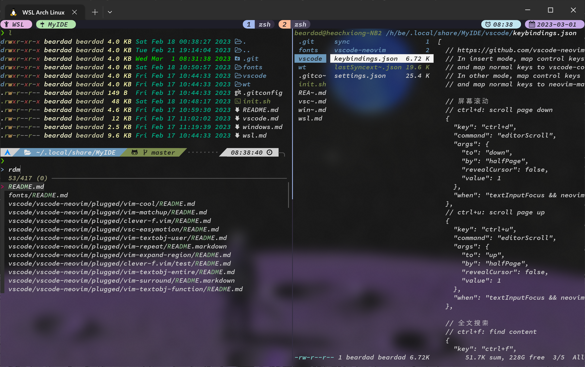
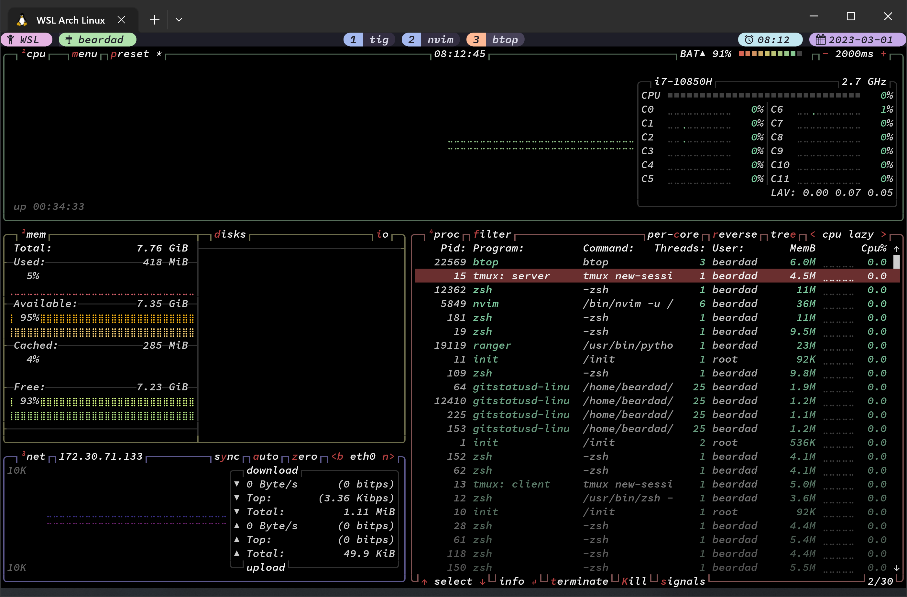
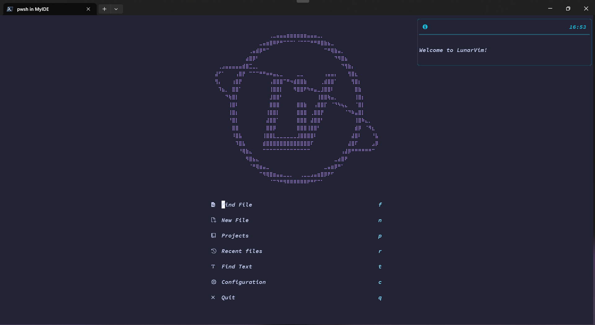
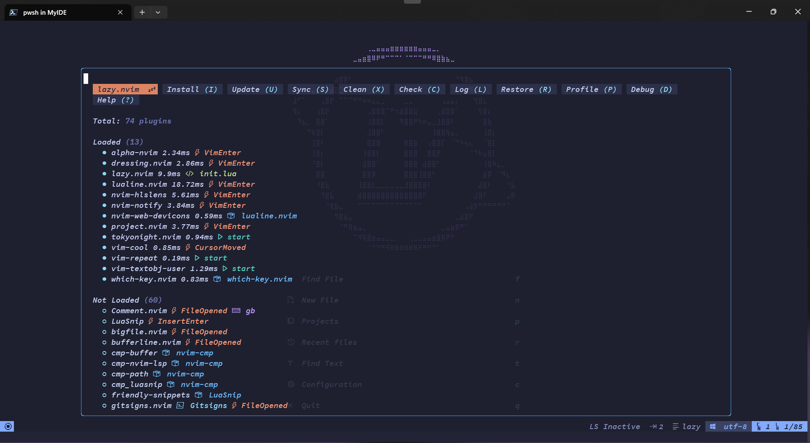
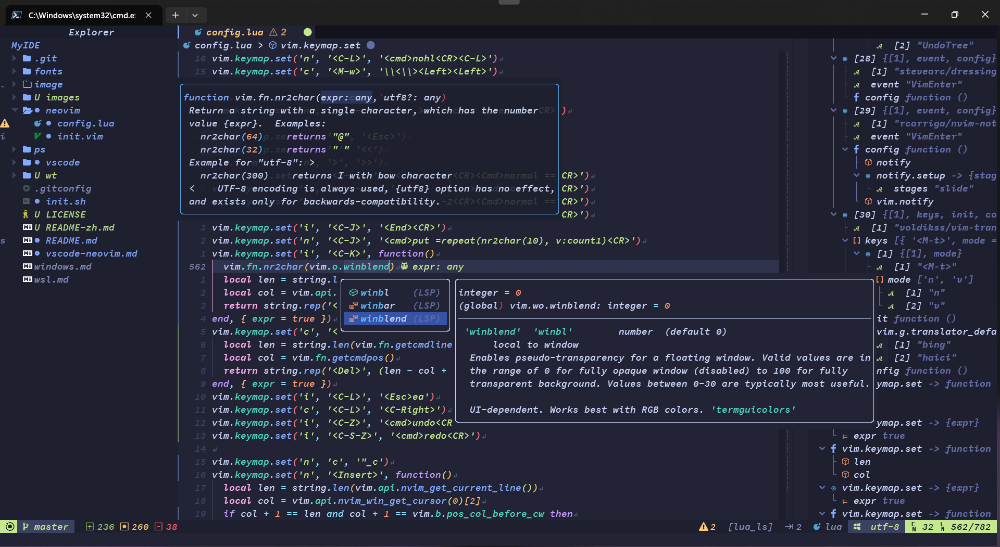
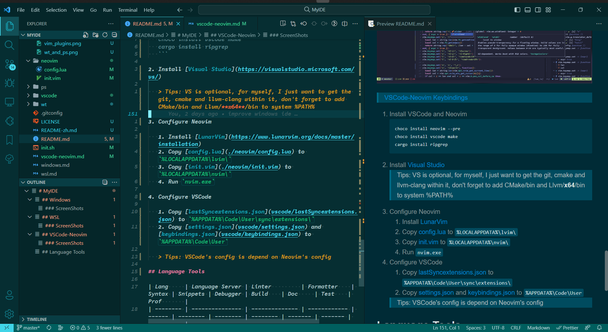

<div align="center">

# MyIDE

✨ 一份帮助你搭建并配置你的开发环境的指南，或者叫笔记，包括 WindowsTerminal, PowerShell, wsl, tmux, zsh, neovim and vscode


</div>

---

- [MyIDE](#myide)
  - [Windows](#windows)
  - [WSL](#wsl)
  - [VSCode-Neovim](#vscode-neovim)
  - [Language Tools](#language-tools)

## Windows

<div align="center">

ScreenShots




</div>

> [Windows 操作手册](windows.md)

1. 使用微软商店安装
   - PowerShell
   - Windows Terminal
   - VSCode
   - PowerToys
   - TranslucentTB
2. 使用浏览器安装
   - [Sogou IME](https://pinyin.sogou.com/)
   - [TIM](https://tim.qq.com)
   - [WeChat](https://pc.weixin.qq.com/?lang=zh_CN)
   - [WeMeeting](https://meeting.tencent.com/download-center.html)
   - [QQ Music](https://y.qq.com/download/index.html)
3. 使用[Scoop-cn](https://github.com/duzyn/scoop-cn)安装

   ```pwsh
   scoop install scoop-cn/7zip scoop-cn/git scoop-cn/aria2 scoop-cn/clash
   ```

   > Tips: 如果你用微软商店或 scoop 安装软件，不要忘记关闭软件自带的自动更新

4. 安装[NerdCodeProPlus font](fonts/)
5. 配置 `%USERPROFILE%\.gitconfig`

   ```conf
   [user]
     name = Heache Bear
     email = mrbeardad@qq.com
   [merge]
     tool = vimdiff
   [mergetool "vimdiff"]
     path = nvim
   ```

6. 配置 `%USERPROFILE%\.ssh\config`

   ```conf
   Host github.com
      HostName github.com
      Port 22
      User git
      IdentitiesOnly yes
      IdentityFile ~/.ssh/github.key
   ```

7. 配置 Windows Terminal[settings.json](wt/settings.json)
8. 配置 PowerShell[$PROFILE](ps/Microsoft.PowerShell_profile.ps1)

   ```pwsh
   # 在拷贝配置文件前先执行命令以安装依赖
   scoop install lsd fzf
   Set-ExecutionPolicy Bypass -Scope Process -Force; Invoke-Expression ((New-Object System.Net.WebClient).DownloadString('https://ohmyposh.dev/install.ps1'))
   Install-Module PSReadLine
   Install-Module PSFzf
   Install-Module ZLocation
   Install-Module posh-git
   Install-Module git-aliases -AllowClobber
   ```

   > Tips: PowerShell 被配置的像 [zsh](wsl.md)

9. 安装 [dual-key-remap](https://github.com/ililim/dual-key-remap/releases) 以映射 CapsLock 键为 Esc（单击）或 Ctrl（与其他按键一起按）

> Tips: 注意根据文档[设置管理员权限启动](https://github.com/ililim/dual-key-remap#administrator-access)，否则在提权窗口中无法使用

10. 系统设置 `Win`+`I`
11. 选一个你喜欢的[鼠标主题](https://zhutix.com/tag/cursors/)

## WSL

<div align="center">

ScreenShots






</div>

> [WSL 操作手册](wsl.md)

1. 安装 WSL2

   ```pwsh
   # 管理员权限
   wsl --install
   wsl --update
   ```

2. 安装 [ArchWSL](https://wsldl-pg.github.io/ArchW-docs/How-to-Setup/)

   > Tips: ArchWSL 是可选的，如果你喜欢 ArchLinux 的话可以设置它为默认版本 `wsl -s Arch`，或者你也可以继续使用默认的 ubuntu

3. 限制 WSL2 [内存使用](https://github.com/microsoft/WSL/issues/4166#issuecomment-526725261)，创建文件`%USERPROFILE%\.wslconfig`并包含以下内容

   ```toml
   [wsl2]
   memory=6GB
   swap=0
   ```

4. 在 wsl 中执行以下脚本来配置整个环境，如 tmux.conf 与 zshrc 之类的配置都在[init.sh](init.sh)脚本最后，你可以单独提取出来配置

   ```sh
   # in wsl
   curl -Lo init.sh https://github.com/mrbeardad/MyIDE/raw/master/init.sh
   # 直接执行，不要 `bash init.sh`
   ./init.sh
   ```

> TIPS: WSL2 访问 Windows 宿主机的代理软件，需要：
>
> 1. 添加防火墙规则，允许宿主机某端口可被访问
> 2. 设置代理软件可接受局域网代理请求
> 3. Windows Host IP 由/etc/resolv.conf 可知

## VSCode-Neovim

<div align="center">

ScreenShots






</div>

> [VSCode 与 Neovim 操作手册](vscode-neovim.md)

1. 安装 Neovim 与依赖

   ```cmd
   scoop install neovim-nightly ripgrep make python nodejs rustup go flutter
   ```

   > Tips: nodejs 之后的包都是可选的

2. 安装[Visual Studio](https://visualstudio.microsoft.com/vs/)

   > Tips: 勾选 clang 选项，同时将
   > `C:\Program Files\Microsoft Visual Studio\2022\Community\VC\Tools\Llvm\x64\bin` 与
   > `C:\Program Files\Microsoft Visual Studio\2022\Community\Common7\IDE\CommonExtensions\Microsoft\CMake\CMake\bin`
   > 加入到环境变量`PATH`

3. 安装[Neovim](https://github.com/neovim/neovim/releases/)与[配置](./neovim/)

   1. 安装 nightly 版本的[LunarVim](https://www.lunarvim.org/docs/master/installation)
   2. 复制[config.lua](./neovim/config.lua)到`%LOCALAPPDATA%\lvim\`下
   3. 复制[init.vim](./neovim/init.vim)到`%LOCALAPPDATA%\nvim\`下
   4. 启动`nvim`自动安装插件

   > Tips: 安装插件需要访问 github，记得开代理

4. 安装[VSCode](https://code.visualstudio.com/download)与[配置](./vscode/)

   1. 复制[lastSyncextensions.json](vscode/lastSyncextensions.json)到`%APPDATA%\Code\User\sync\extensions\`下
   2. 复制[settings.json](vscode/settings.json)与[keybindings.json](vscode/keybindings.json)到`%APPDATA%\Code\User`下
   3. 启动 VSCode 自动安装插件

   > Tips: VSCode 的配置依赖 Neovim 的配置

## Language Tools

| Lang       | Language Server | Linter        | Formatter    | Syntax | Snippets | Debugger | Build    | Doc     | Test    | Prof       |
| ---------- | --------------- | ------------- | ------------ | ------ | -------- | -------- | -------- | ------- | ------- | ---------- |
| C++        | clangd          | clang-tidy    | clang-format | -      | -        | lldb     | CMake    | Doxygen | gtest   | gperftools |
| Go         | gopls           | golangci-lint | gofmt        | -      | -        | delve    | go-build | swag    | testify | go-prof    |
| Python     | pyright         | ruff          | black        | -      | -        | -        | -        | -       | -       | -          |
| JavaScript | tsserver        | eslint        | eslint       | -      | -        | -        | -        | -       | -       | -          |
| HTML       | -               | tidy          | prettier     | -      | -        | -        | -        | -       | -       | -          |
| CSS        | -               | stylelint     | prettier     | -      | -        | -        | -        | -       | -       | -          |
| Markdown   | -               | markdownlint  | prettier     | -      | -        | -        | -        | -       | -       | -          |

Other references:

- [Language Server](https://microsoft.github.io/language-server-protocol/implementors/servers/)
- [Awesome Linters](https://github.com/caramelomartins/awesome-linters)
