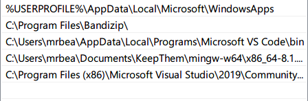
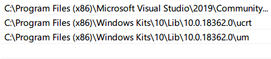
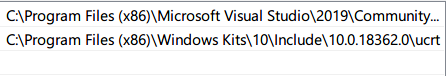

# Windows10配置

这篇文档只是做个我的个人日志，方便下次重装

## 驱动程序
* MyASUS  
[下载](https://www.microsoft.com/zh-cn/p/myasus/9n7r5s6b0zzh?activetab=pivot:overviewtab)

## 浏览器
* Microsoft Edge  
[下载](https://www.microsoft.com/zh-cn/edge)

* Google Chrome  
[下载](https://www.google.cn/chrome/)

## 准备
* 设置chrome的下载目录为`C:\Users\username\Downloads\GoogleChrome-Downloads`

* 修改`C:\Windows\System32\drivers\etc\hosts`解决DNS污染，[下载](https://gitee.com/mrbeardad/Windows10/blob/master/hosts)

* 安装google-access-helper，登录并同步chrome配置<a href=## title="这种东西还是自己去发现吧(●'◡'●)ﾉ♥">下载</a>

* 登录Windows、edge、chrome和chrome各插件

## 应用软件
* [Bandizip 压缩包工具](https://www.bandizip.com/)

* [RIME输入法](https://rime.im/download/)，
[下载配置与词库](https://gitee.com/mrbeardad/rime-dict)并安装到`C:\Users\mrbea\AppData\Roaming\Rime`

* [TIM 通讯](https://tim.qq.com)

* [百度网盘](https://pan.baidu.com/downloads)

* [Listen1 音乐](https://www.zhyong.cn/posts/64cd/)

* [万彩办公大师](http://www.wofficebox.com/)

* [CHFS 文件共享服务器](http://iscute.cn/chfs)

* [Dism++ 系统清理与优化](https://www.chuyu.me/zh-Hans/)

* [Geek 卸载工具](https://geekuninstaller.com/)

* [Listary 搜索工具](https://www.listarypro.com/download)

* [PowerToys 工具集](https://github.com/microsoft/PowerToys/releases)

* [TranslucentTB 任务栏美化](https://www.microsoft.com/zh-cn/p/translucenttb/9pf4kz2vn4w9?activetab=pivot:overviewtab)

* [TrafficMonotor 资源检测器](https://github.com/zhongyang219/TrafficMonitor)

* [Rainmeter 桌面美化](https://www.rainmeter.net/)与[Elegance-2皮肤](https://visualskins.com/skin/elegance-2)

* [noMeiryoUI 字体设置](https://github.com/Tatsu-syo/noMeiryoUI/releases)

* [MacType 字体渲染](https://github.com/snowie2000/mactype/releases)

## 个性化设置
* 夜间暖色模式
    > Setting -> System -> Display -> Nignt light settings

* 硬盘自动清理
    > Setting -> System -> Storage -> Configure Storage Sense or run it now

* 更改主机名
    > Settings -> System -> About -> Rename your PC

* 自动链接可用网络
    > Settings -> Network & Internet -> Status

* 更改用户头像
    > Settings -> Accounts -> Your info -> Create your picture

* 更改鼠标大小
    > Settings -> Ease of Access -> Mouse pointer -> change pointer size

* 大小写提示音
    > Settings -> Ease of Access -> Keyboard -> Use Toggle Keys

* 关闭蓝牙
    > Settings -> Devices -> Bluetooth & other devices

* 更改背景图片
    > Settings -> Personalization -> Background

* 更改主题颜色
    > Settings -> Personalization -> Colors

* 更改鼠标主题
    > Settings -> Personalization -> Themes -> Mouse cursor  
    > 需要将[主题文件](win10/彩色光标.zip)安装到`C:\Windows\Cursors`

* 安装字体
    > Settings -> Personalization -> Fonts  
    > [Source Code Pro Nerd字体](https://mirrors.cloud.tencent.com/archlinuxcn/x86_64/nerd-fonts-source-code-pro-2.1.0-4-any.pkg.tar.zst)、
    > [Space Mono Nerd字体](https://mirrors.cloud.tencent.com/archlinuxcn/x86_64/nerd-fonts-space-mono-2.1.0-4-any.pkg.tar.zst)、
    > [IBM Plex Mono Nerd字体](https://mirrors.cloud.tencent.com/archlinuxcn/x86_64/nerd-fonts-ibm-plex-mono-2.1.0-4-any.pkg.tar.zst)、
    > 注意：Windows下的应用一般无法选择style，故只安装好看的style而不全装  
    > 注意：Windows Terminal字体不要使用Mono版本，会导致图标字体太小

* 设置StartMenu
    > Settings -> Personalization -> Start -> Choose which folders appear on Start
    > * 全屏
    > * 磁贴大小与位置
    > * 侧栏文件夹快速访问
    > * 简化开始菜单显示内容

* 设置TaskBar
    > Settings -> Personalization -> Taskbar  
    > * 任务栏位置
    > * 任务栏图标位置
    > * 任务栏图标大小

* 自动同时时间与设置时区
    > Settings -> Time & Language -> Date & time

* 更改系统语言
    > Settings -> Time & Language -> Language

* 所在地区与时间显示格式
    > Settings -> Time & Language -> Region

* 关闭或卸载不必要的应用
    > Settings -> Apps -> Apps & features  
    > 可以用Geek卸载

* 设置打开文件的默认应用
    > Settings -> Apps -> Default apps

* 设置开机自启应用
    > Settings -> Apps -> Startup

* 视频性能设置
    > Settings -> Apps -> Video playback

## 开发工具：
* WindowsTerminal终端，[下载](https://www.microsoft.com/zh-cn/p/windows-terminal/9n0dx20hk701?activetab=pivot:overviewtab)，
[配置](https://github.com/mrbeardad/Windows10/blob/master/win10/settings.json)

* WSL，[下载](https://www.microsoft.com/zh-cn/p/ubuntu-2004-lts/9n6svws3rx71?activetab=pivot:overviewtab)
    1. 管理员权限运行`wt`：
        * `dism.exe /online /enable-feature /featurename:Microsoft-Windows-Subsystem-Linux /all /norestart`
        * `dism.exe /online /enable-feature /featurename:VirtualMachinePlatform /all /norestart`
        * `Enable-WindowsOptionalFeature -Online -FeatureName Microsoft-Windows-Subsystem-Linux`
    2. 重启后打开WSL进行初始化
    3. 升级WSL2：
        1. 下载[升级包](https://wslstorestorage.blob.core.windows.net/wslblob/wsl_update_x64.msi)
        2. 执行`wsl --set-version <Distro> 2`

* VSCode编辑器，[下载](https://code.visualstudio.com/download)，[配置](vscode/settings.json)
    * Remote-WSL
    * Vim
    * C/C++
    * C++ Intellisense
    * Code Runner

* VS编译套件，[下载](https://visualstudio.microsoft.com/downloads/#other)
    > 控制面板》系统与安全》系统》高级系统设置》环境变量》PATH、LIB、INCLUDE  
    >   
    >   
    > 

* Docker，[下载](https://links.jianshu.com/go?to=https%3A%2F%2Fwww.docker.com%2Fproducts%2Fdocker-desktop)

> * [mingw编译套件下载](https://pan.baidu.com/s/17JPRFzeZEhqxceWUTXTAog)，密码`c8uc`  
>
> * Alacritty终端，[下载](https://github.com/alacritty/alacritty/releases)，
>     [配置](https://github.com/mrbeardad/Windows10/blob/master/alacritty/alacritty.yml)
>     安装到`C:\Users\mrbea\AppData\Roaming\alacritty\alacritty.yml`

# 快捷键

| 文件管理器或文件编辑器快捷键                  | 功能      |
|-----------------------------------------------|-----------|
| <kbd>Ctrl</kbd>+<kbd>A</kbd>                  | 全选      |
| <kbd>Ctrl</kbd>+<kbd>C</kbd>                  | 复制      |
| <kbd>Ctrl</kbd>+<kbd>X</kbd>                  | 剪切      |
| <kbd>Del</kbd>                                | 删除      |
| <kbd>Ctrl</kbd>+<kbd>V</kbd>                  | 粘贴      |
| <kbd>Ctrl</kbd>+<kbd>Z</kbd>                  | 撤销      |
| <kbd>Ctrl</kbd>+<kbd>F</kbd>                  | 搜索      |
| <kbd>Ctrl</kbd>+<kbd>O</kbd>                  | 打开      |
| <kbd>Ctrl</kbd>+<kbd>Shift</kbd>+<kbd>N</kbd> | 新建目录  |
| <kbd>BackSpace</kbd>                          | 返回/删除 |

| Win快捷键                                    | 功能              |
|----------------------------------------------|-------------------|
| <kbd>Win</kbd>+<kbd>num</kbd>                | 任务栏第num个软件 |
| <kbd>Win</kbd>+<kbd>E</kbd>                  | 文件管理器        |
| <kbd>Win</kbd>+<kbd>I</kbd>                  | 设置中心          |
| <kbd>Win</kbd>+<kbd>A</kbd>                  | 通知与操作中心    |
| <kbd>Win</kbd>+<kbd>G</kbd>                  | 游戏与多媒体中心  |
| <kbd>Win</kbd>+<kbd>.</kbd>                  | emoji面板         |
| <kbd>Win</kbd>+<kbd>V</kbd>                  | 粘贴板            |
| <kbd>Win</kbd>+<kbd>+</kbd>                  | 放大镜            |
| <kbd>Win</kbd>+<kbd>shift</kbd>+<kbd>c</kbd> | 捕色器            |

| 桌面快捷键                                    | 功能           |
|-----------------------------------------------|----------------|
| <kbd>Win</kbd>+<kbd>D</kbd>                   | 显示桌面       |
| <kbd>Win</kbd>+<kbd>,</kbd>                   | 预览桌面       |
| <kbd>Win</kbd>+<kbd>M</kbd>                   | 最小化所有桌面 |
| <kbd>Win</kbd>+<kbd>L</kbd>                   | 锁定桌面       |
| <kbd>Win</kbd>+<kbd>R</kbd>                   | 运行对话框     |
| <kbd>Ctrl</kbd>+<kbd>Win</kbd>+<kbd>D</kbd>   | 新建虚拟桌面   |
| <kbd>Ctrl</kbd>+<kbd>Win</kbd>+<kbd>F4</kbd>  | 关闭虚拟桌面   |
| <kbd>Ctrl</kbd>+<kbd>Win</kbd>+<kbd>←/→</kbd> | 切换虚拟桌面   |
| <kbd>Win</kbd>+<kbd>Tab</kbd>                 | 多任务视图     |

| 窗口快捷键                        | 功能                   |
|-----------------------------------|------------------------|
| <kbd>Win</kbd>+<kbd>↑/↓/←/→</kbd> | 最大化/最小化/左右分屏 |
| <kbd>Alt</kbd>+<kbd>Tab</kbd>     | 切换窗口               |
| <kbd>Alt</kbd>+<kbd>F4</kbd>      | 关闭窗口               |

